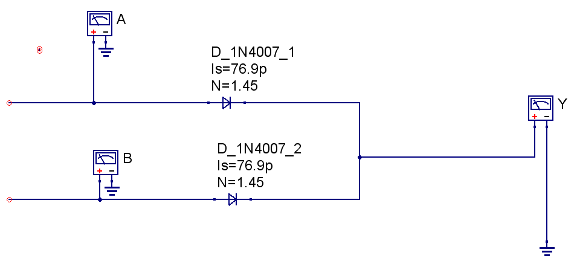
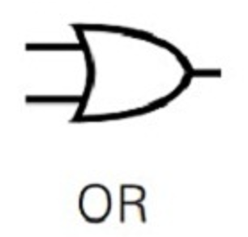
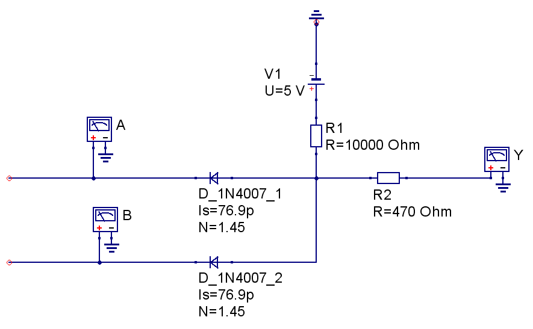
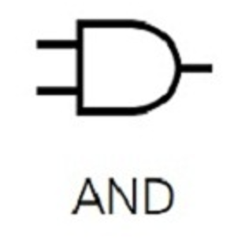
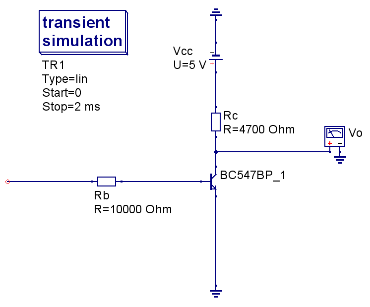
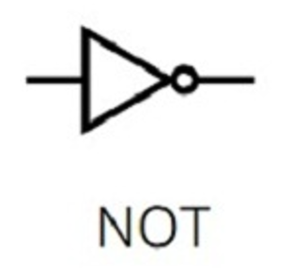
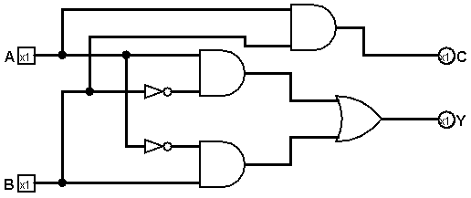
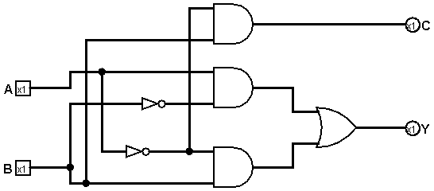
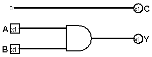
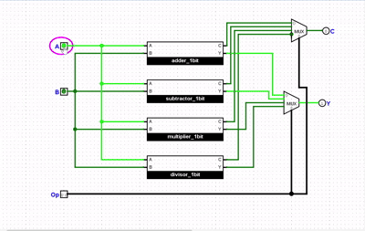

# My Simple Computer
---

<div id="google_translate_element"></div>

<script type="text/javascript">
function googleTranslateElementInit() {
  new google.translate.TranslateElement({
    pageLanguage: 'en',
    includedLanguages: 'bn',
    layout: google.translate.TranslateElement.InlineLayout.SIMPLE
  }, 'google_translate_element');
}
</script>

<script type="text/javascript" 
        src="//translate.google.com/translate_a/element.js?cb=googleTranslateElementInit">
</script>

---
In this blog I will explain how could we make a simple one bit ALU(Arithmatic Logic Unit) which is the main backbone of a CPU.

In Binary 0 means 0 Volt and 1 means 5 Volt.

We use 1 bit binary Operations.
The Simple Output expected:
```
Addition:
0 + 0 = 0
1 + 0 = 1
0 + 1 = 1
1 + 1 = 10

Subtraction:
0 - 0 = 0
1 - 0 = 1
0 - 1 = 11 [1 means negative]
1 - 1 = 0

Multiplication:
0 x 0 = 0
1 x 0 = 0
0 x 1 = 0
1 x 1 = 0

Division:
0 / 0 = 0 [Undfined]
1 / 0 = 0 [Undefined]
0 / 1 = 0
1/ 1 = 1
```

The following Components required for 1 bit ALU:
To build All Gates you need following components. I gave low price amzon links although those are high price. I think Chadni Chawk offline shops are best for low price.Here One Resistors pack you may get all required resistors.

| Components           | Nos  |
|----------------------|------|
| [Transistor BC547](https://www.amazon.in/Chanzon-100pcs-BC547B-Transistor-bc547/dp/B083TMBRVB/ref=sr_1_2?crid=3FHYBUVEXPEYD&dib=eyJ2IjoiMSJ9.nsRYrkHFDU1XykQPprJqW3ETjHeTpkc2Mnc0Vcf44lF9Bi0TG6CpwqAwsaj09LS0w-Tsj00fNd-wHE_8_jFGekHUpM8Yzu6ElnJ_yTJhPd-xNt2k4DRbVoqkK8xib2NUFCWkfKNYB_zC8YSl3w1CgI_E3LRtI76TrTPiHAjZU57ABFFztBLacfmOaJEqbMwtePeU1qocFVO0qA8w5i5sJCeL4L8POXbKkY9YmroblA_zfR08G4U1uu9vFpCrHjvnDzpi7N3CP77D9AlsG_ILkE5XGDbc0sO9shuQMTrpch0.CyxyNb0864bhedqG98tnOnFGdJN4falbC1uwebmXZbg&dib_tag=se&keywords=bc547b&qid=1759523332&sprefix=bc547b%2Caps%2C304&sr=8-2)     | 5    |
| [1N4007 diode](https://www.amazon.in/Vasp-Electronics-1N4007-Diode-1000v/dp/B079Z9MPYC/ref=sr_1_1_sspa?crid=T1DY928JWO6H&dib=eyJ2IjoiMSJ9.98hitS0dhH_lDmRJeJp6irFxcoiDprW34oJlkudejnTs8cb1cNHRU1gZHPP2v59zVTeiVo-doMuQkEcVZebm4fQtNI4hy3oJXd8Hmhb7Yzeg8clFVpchNAlIKSvE9sf59C7TI3_KqK0Sz19oJb_LeP1W_pyujHdk5tR1n3wPQ4LjTBziOvO1lSbqd61QEmlvF4wmCasxLhtk1LcYZNeRe_VmdwLKBfqpAqkZWwcPv2jUCAoQIGsyYCS0YLX7-4ggtS16wZAos8QNSiPa8vKUcwoJTfUpGS3pWGpErALNgQU.uKttqbhljAjB98EoXrSOlTksxlHr-YD472YCLT3sbXw&dib_tag=se&keywords=1n4007+diode&qid=1759523387&sprefix=1n4007+diode%2Caps%2C243&sr=8-1-spons&sp_csd=d2lkZ2V0TmFtZT1zcF9hdGY&psc=1)               | 18   |
| [Resistance(1 KOhm)](https://www.amazon.in/AVS-Components-Resistors-Assortment-Electronics/dp/B0D6LRHHVZ/ref=sr_1_4_sspa?crid=1JELNW1NUEH4U&dib=eyJ2IjoiMSJ9.UQQBG3p5tpUFQUDz3IJvRWF8pZAPTEHK6bbD_T2xvBopwUpm8viQBhtjNPKaUCUU5fpi7BcPBAEkBMcUYIE-X1PKlnl1yAgegEk6tk35FLJAEfGUWzxDqvIctx3kHi5nCpaxInVe_nOR0znI3n3turAB8ZXCOSNN4o0Bee7i8j9vrnlr2OIEZgq2jlc_iJVzTc4jLGoPWsHjAL1hvwChqcYjopl5bNaYnj-4j-MhsQ1imCi267sEGKftu84Nz5CJxW_6F3LudNxW2dSVH9TLSY60IDLkIqpqnI-i7YXtqEg.R-12JO-YsDvH-i0CAXxvBHxkgMfX4cCSS1rwpVvm2ew&dib_tag=se&keywords=resistors+pack&qid=1759523435&sprefix=resistors+pack%2Caps%2C269&sr=8-4-spons&sp_csd=d2lkZ2V0TmFtZT1zcF9hdGY&psc=1)   | 7    |
| Resistance(10 KOhm)  | 5    |
| Resistance(4.7 KOhm) | 5    |
| [LED](https://www.amazon.in/Electronic-Spices-Bright-colour-Emitting/dp/B0B4K6D7S7/ref=sr_1_5?crid=PDCWWSL7S5XL&dib=eyJ2IjoiMSJ9.EvRz1xF7LSRGJ4AatGfRWac3bouZQQU4djd7rpaXhPtzVWSyiE8hSa0uk14LO-08cCBKAw_03aTTCdihkqR8f8A4IXuT5d2eV3MLbDHE_b_ejLLvQpaze8CRE4IZAFeGg4kxolZW8AluBYp33L4TWVzRSGytKyggHPT-wU1RbZxDy_75EM8GK5_8WfK1HlsEp97EDpnUXc-NGirwnAmBHWcjiFO0Uff12UhBqR7x_gvY36AOMoDLWMIhEtUCKb7ArCXWl89_l9sxd_fBlxvGA6g8zboVpxTi0fThqpjSOwc.wdDrhtgZvSZxMqnZM2WXqE8Ow1UyQM0tNOVFudpFJxo&dib_tag=se&keywords=led%2Bpack&qid=1759523486&sprefix=led%2Bpack%2Caps%2C294&sr=8-5&th=1)                  | 4    |
| [Battery Holder](https://www.amazon.in/Electronicspices-18650-Battery-Holder-Leads/dp/B0863TC797/ref=sr_1_5?crid=2P1244BCL8G23&dib=eyJ2IjoiMSJ9.WmXVCRUc1hj1MiuINfVzwF714sk13ANYbLTHVWkoWjcFZrkpos2gKFA58fmC2zeDGY0ZzBQvC7yIAGKMka4d5QJBnwPKP-eNIGYIacxfN_NaRuJpzmjPKFdHhkxpxj8SZxpoF-pFbkU9XW62T_3fVCmxzHIxsDMxepC_ycphhLOGkhXCmyfhVNq4nmuMNxZdOowq-eaZ9kO_cCO0L9jJNjhzZFQpeiKqBb8Dw3AvpkXaZUATQdGdGelrV3CCjT2VegUCNE57LyCJeBzKTO5j_dMYIAMqzsRboiEgqidCyDI.GHCKPa2qiL8WN4JSrknX5tQmETFF4D0qktPPuJJtJjc&dib_tag=se&keywords=battery+holder&qid=1759523588&sprefix=battery+holder%2Caps%2C270&sr=8-5) | 2 |
| 5 Volt power source  | 1    |
| Wires                |      |
| [Bread board](https://www.amazon.in/Themisto-TH-B400-Breadboard-400-Points/dp/B0CGJ4ZBTC/ref=sr_1_5?crid=BKNM5IOAKJSM&dib=eyJ2IjoiMSJ9.90gKDzZV_VCdozK0sQaNg6i22P9CLXOnkGZLIwwqVKWc3OSH0u_wVBUiDItZf0DvkiTVfpwZ2wqG4KFSyiZ396HFGD8B2pFLN1KSgkDk2ZCmn4xhrsIVXVmF3FWXChAA8MozzpRto85LTZTQ3GYBFQuhkq_3dL9ps2lyRNCPu78DohZXvi0h0Y0_PZgoyDSOIzN9kxCZOuWcYYxOx1j_RB5RDgM7m2xWmrV3180gR31osBQaakoAS1_QbuHEV0Ds_-qxiHuqMX2THM7smvUCW6FM01AC5fpS-E1huwHGeX4.UOtSqFt9thG47df40Zkg_cQ3UOM_McYKeB5kxCG7LX4&dib_tag=se&keywords=bread%2Bboard&qid=1759523665&sprefix=bread%2Bboard%2Caps%2C271&sr=8-5&th=1)          | 2-4  |
| Patience             |      |

If you do not have bread board you can connect manually which will be a tough job for you.


Circuit Diagram:

1. OR Gate:
The below circuit will use to build up a single OR gate which will give OR Operation where OR operation is like when we give two input at A and B we give Y output then the Input vs Output values should be written in following Truth table


| A | B | Y |
|---|---|---|
| 0 | 0 | 0 |
| 0 | 1 | 1 |
| 1 | 0 | 1 |
| 1 | 1 | 1 |

The symbol of OR gate is shown in below


2. AND Gate:
The below circuit will be use to make AND gate.

Where if we give two input A and B in And Gate we will get Y output by following way:

| A | B | Y |
|---|---|---|
| 0 | 0 | 0 |
| 0 | 1 | 0 |
| 1 | 0 | 0 |
| 1 | 1 | 1 |

The symbol of AND gate is shown in below


3. NOT Gate:
The NOT gate only take single input and give oposite output:
The below citrcuit will use to make NOT gate


| A | Y |
|---|---|
| 0 | 1 |
| 1 | 0 |

The symbol of NOT gate is shown in below


In the below circuit diagram we will use block diagram of OR, AND and NOT gate instead of their details internel diagram.

4. Adder:
If we place input A and B we will get output at Y:
```
0 + 0 = 0
1 + 0 = 1
0 + 1 = 1
1 + 1 = 10
```


5. Subtractor:
If we place input A and B we will get output at Y:
```
0 - 0 = 0
1 - 0 = 1
0 - 1 = 11 [1 means negative]
1 - 1 = 0
```


6. Multiplier:
If we place input A and B we will get output at Y:
```
0 x 0 = 0
1 x 0 = 0
0 x 1 = 0
1 x 1 = 0
```


7. Divisor:
If we place input A and B we will get output at Y:
```
0 / 0 = 0
1 / 0 = 0
0 / 1 = 0
1 / 1 = 0
```


## Simulation animation in LogiSim:



In future we can build 4 bit, 8 bit, 16 bit and 32 bit and 64 bit ALU.
To build more input bit ALU required complex circuit but it will be easy if we use custom made ICs which have prebuild OR, AND and NOT gates.

Best of luck for your project.

I use [Qucs](https://qucs.sourceforge.net/) for digital simulation and [logisim](https://sourceforge.net/projects/circuit/) for analog simulation.

© 2025 Build a Simple ALU. All Rights Reserved.
