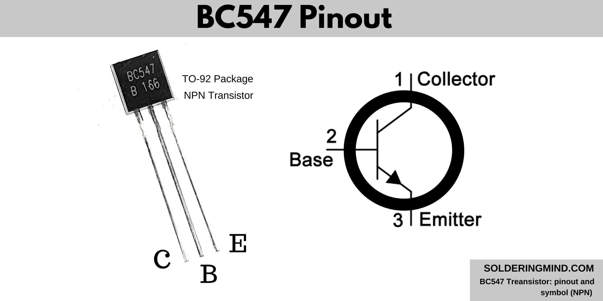

# My Simple Computer
---

In this blog, I will explain how we can build a **simple 1-bit ALU (Arithmetic Logic Unit)**, which forms the core of a CPU.

In binary logic, **0 represents 0 Volt** and **1 represents 5 Volt**.  
We will use **1-bit binary operations**.  

Here’s the expected output for our ALU:

```
Addition:
0 + 0 = 0
1 + 0 = 1
0 + 1 = 1
1 + 1 = 10

Subtraction:
0 - 0 = 0
1 - 0 = 1
0 - 1 = 11 [1 indicates negative]
1 - 1 = 0

Multiplication:
0 x 0 = 0
1 x 0 = 0
0 x 1 = 0
1 x 1 = 1

Division:
0 / 0 = 0 [Undefined]
1 / 0 = 0 [Undefined]
0 / 1 = 0
1 / 1 = 1
```


---

## Components Required for 1-bit ALU(Without Multiplexer or Mux)
To build all the gates, you will need the following components. I’ve included Amazon links for reference, but you can find cheaper options at local electronics shops like **Chandni Chowk**. A resistor pack may cover most of your requirements.

| Component           | Quantity | Link |
|--------------------|----------|------|
| [Transistor BC547](https://www.amazon.in/Chanzon-100pcs-BC547B-Transistor-bc547/dp/B083TMBRVB) | 5 | Amazon |
| [1N4007 Diode](https://www.amazon.in/Vasp-Electronics-1N4007-Diode-1000v/dp/B079Z9MPYC) | 18 | Amazon |
| Resistors (1 KΩ) [Pack](https://www.amazon.in/AVS-Components-Resistors-Assortment-Electronics/dp/B0D6LRHHVZ) | 7 | Amazon |
| Resistors (10 KΩ) | 5 | - |
| Resistors (4.7 KΩ) | 5 | - |
| [LED](https://www.amazon.in/Electronic-Spices-Bright-colour-Emitting/dp/B0B4K6D7S7) | 4 | Amazon |
| [Battery Holder](https://www.amazon.in/Electronicspices-18650-Battery-Holder-Leads/dp/B0863TC797) | 2 | Amazon |
| 5V Power Source | 1 | - |
| Wires | - | - |
| [Breadboard](https://www.amazon.in/Themisto-TH-B400-Breadboard-400-Points/dp/B0CGJ4ZBTC) | 2–4 | Amazon |
| Patience | - | - |

> Note: If you don’t have a breadboard, you can wire everything manually, but it will be much more difficult.

---

## Circuit Diagrams

### 1. OR Gate
This circuit creates a **single OR gate**, where the output `Y` is 1 if either `A` or `B` is 1.  

| A | B | Y |
|---|---|---|
| 0 | 0 | 0 |
| 0 | 1 | 1 |
| 1 | 0 | 1 |
| 1 | 1 | 1 |

  
**Symbol:**  


---

### 2. AND Gate
The AND gate outputs 1 **only if both inputs are 1**.

| A | B | Y |
|---|---|---|
| 0 | 0 | 0 |
| 0 | 1 | 0 |
| 1 | 0 | 0 |
| 1 | 1 | 1 |

  
**Symbol:**  


---

### 3. NOT Gate
The NOT gate **inverts a single input**.

| A | Y |
|---|---|
| 0 | 1 |
| 1 | 0 |

Before wireing identify the BC547B Pin.



The flat surface of transistor in front of you then left side will be Collector and middle pin will be base and right pin will be Emmiter. Before powering up the transistor make sure you connect proper pin otherwise the transistor get damaged.

  
**Symbol:**  


---

### 4. Adder
The adder combines `A` and `B` to produce a sum `Y`.

```
0 + 0 = 0
1 + 0 = 1
0 + 1 = 1
1 + 1 = 10
```


---

### 5. Subtractor
The subtractor outputs the difference between `A` and `B`.

```
0 - 0 = 0
1 - 0 = 1
0 - 1 = 11 [1 indicates negative]
1 - 1 = 0
```


---

### 6. Multiplier
The multiplier outputs the product of `A` and `B`.

```
0 x 0 = 0
1 x 0 = 0
0 x 1 = 0
1 x 1 = 1
```


---

### 7. Divider
The divider outputs the quotient of `A` divided by `B`.


```
0 / 0 = 0 [Undefined]
1 / 0 = 0 [Undefined]
0 / 1 = 0
1 / 1 = 1
```


---

## Simulation in Logisim
Here’s an example of a simulation animation in Logisim:


The above circuit made with use of 4x2 Multiplexer (MUX) which help to select proper output by using op code. If you do not use MUX then you need to change manually to get right output from four operations (+ - x /). Otherwise you could use [rotary switch](https://amzn.in/d/iqVN76d) which select single output from 4 output found from four operations.
---

### Future Enhancements
We can extend this design to **4-bit, 8-bit, 16-bit, 32-bit, and 64-bit ALUs**. For larger ALUs, circuits become more complex, but using **prebuilt ICs** for OR, AND, and NOT gates makes it manageable.

---

> **Tip:** Use Qucs for **digital simulations** and Logisim for **analog simulations**.

---

## Scaling to Multi-bit ALUs
- **4-bit, 8-bit, 16-bit, 32-bit ALUs** follow the same principles.  
- Use **carry propagation** in adders for multi-bit addition.  
- Prebuilt ICs (AND, OR, NOT gates) simplify complex circuits.

---

## Exercises for the Reader
1. Build a **2-bit adder** using two 1-bit adders.  
2. Modify the ALU to include **XOR and NAND operations**.  
3. Simulate a subtraction that results in a negative number and observe the binary representation.  

---

## Troubleshooting Tips
- Double-check LED polarity.
- Ensure correct resistor values to avoid damaging components.
- Use a breadboard to prevent short circuits.
- Simulate before building the physical circuit.
- never connect batteries + and - otherwise battery get damaged.

---

## References
- [Qucs Digital Simulator](https://qucs.sourceforge.net/)  
- [Logisim Circuit Simulator](https://sourceforge.net/projects/circuit/)  
- Datasheets: BC547, 1N4007  

---
 

Good luck with your project!  

© 2025 Build a Simple ALU. All Rights Reserved.

